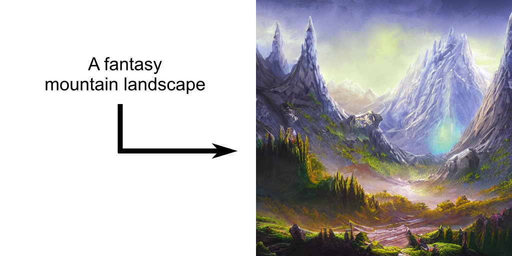
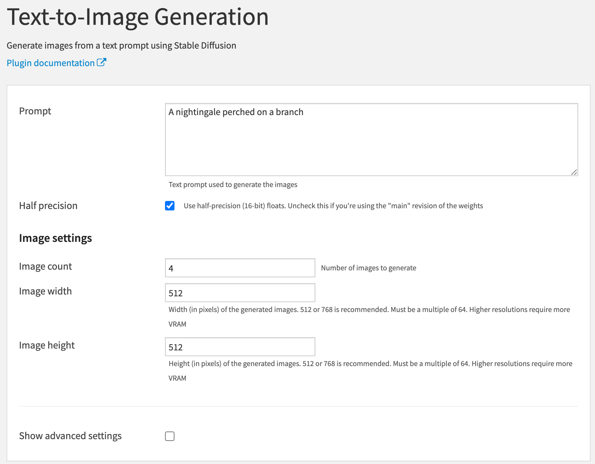
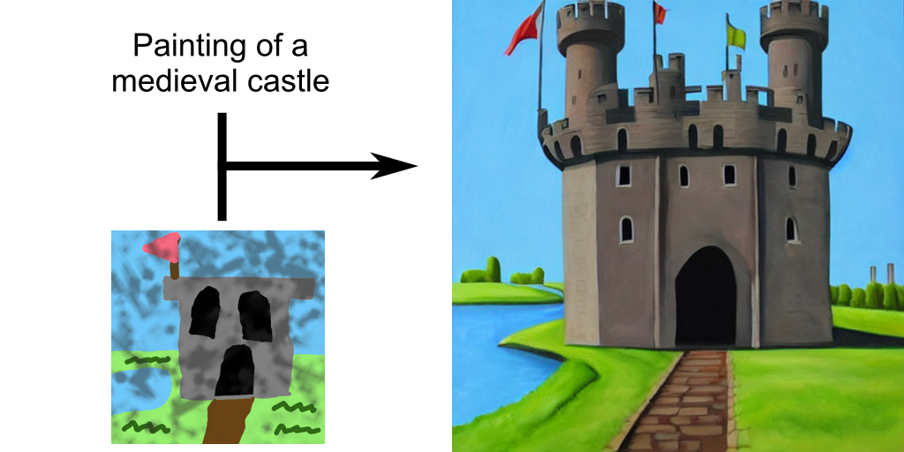
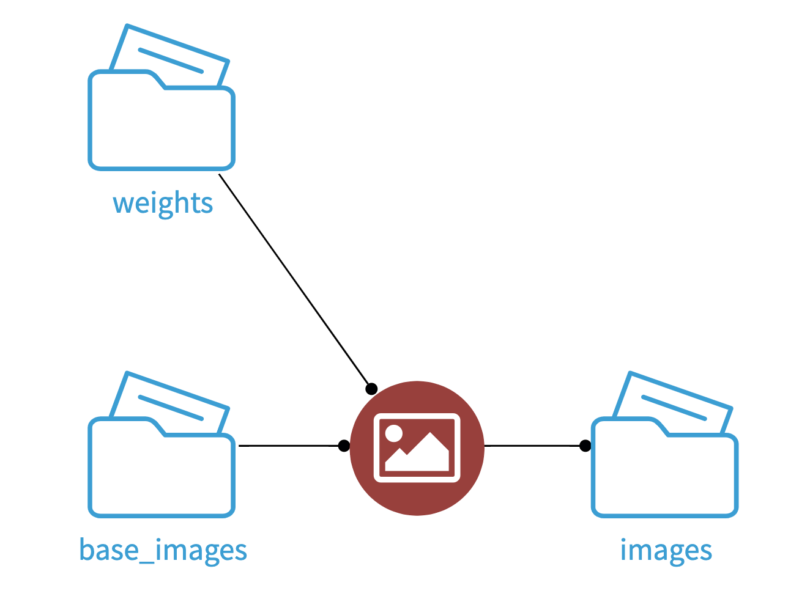
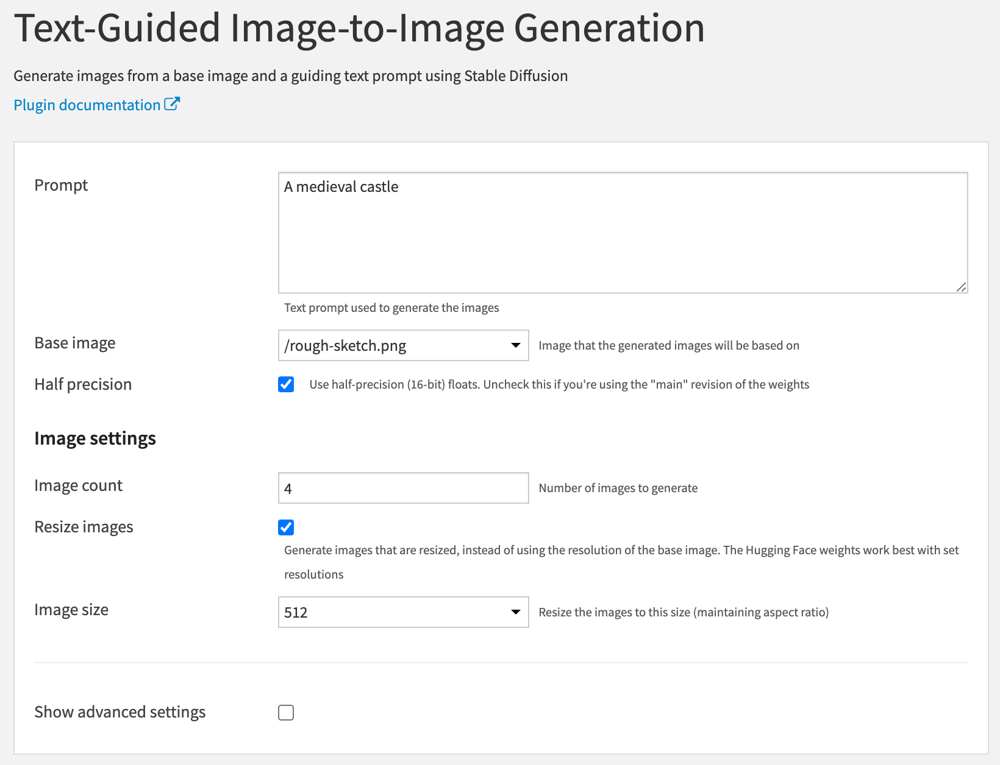

AI Art
%%%%%%

This plugin allows you to generate images from text using
`Stable Diffusion <stable-diffusion-wiki_>`_

   An image generated by AI Art using the prompt "A pirate ship sailing in outer
   space"

How to set up
=============

CUDA
----
A CUDA-capable GPU with at least 6 GB of VRAM is recommended.
You can run the plugin without a GPU, but it will be significantly slower.

If you're using a CUDA GPU, the NVIDIA drivers must be installed on the server.
For installation instructions, see
`NVIDIA Driver Installation Quickstart Guide <nvidia-install-guide_>`_.

Download weights
----------------
Before you can use the plugin, you need pre-trained weights. You can download
weights from Hugging Face using the provided macro.

.. warning::
   The weights available on Hugging Face are licensed under the CreativeML
   OpenRAIL-M license, which restricts usage. You can view the license
   `here <compvis-license_>`_.

   If you don't agree with the license, you can alternatively use your own
   weights and skip this section

#.  Install `Git LFS <git-lfs_>`_ on the DSS server:

    RHEL-based distros:

    .. code-block:: bash

       yum install git-lfs
       git lfs install --system

    Debian-based distros:

    .. code-block:: bash

       apt install git-lfs
       git lfs install --system

    macOS (using `Homebrew <homebrew_>`_):

    .. code-block:: bash

       brew install git-lfs
       git lfs install

#.  Create a `Hugging Face <hugging-face-sign-up_>`_ account if you don't
    already have one.

#.  Create a read-only access token in your
    `account settings <hugging-face-token-settings_>`_. This will be used by DSS
    to access Hugging Face.

#.  Choose the model that you want to download from `Runway's <runway-org_>`_ or
    `CompVis' <compvis-org_>`_ organization page, and agree to the license in
    order to access the repository.

    .. note::
       If you're not sure which model to choose, pick the one with the highest
       version, e.g. *runwayml/stable-diffusion-v1-5*.

#.  Create a managed folder in DSS, and download your chosen model to it using
    the *Download Stable Diffusion weights* macro.

    .. warning::
       Using a folder that's stored on the local filesystem is recommended. If
       the folder is stored on a remote connection (Amazon S3, Google Cloud
       Storage, etc), the weights will be downloaded to a temporary directory
       every time the recipe is run.

    .. image:: _static/instructions-macro-1.png
       :alt: Screenshot showing where to access the macro in the Flow

How to use
==========
AI Art contains two methods for generating images: Text-to-Image Generation, and
Text-Guided Image-to-Image Generation

Text-to-Image Generation
------------------------
Text-to-Image Generation is used to generate images from a text prompt.

.. image:: _static/instructions-text-to-image-1.png
   :alt: Screenshot showing what the Flow looks like when using the recipe

#.  Create a *Text-to-Image Generation* recipe with your weights folder as the
    input.

#.  Enter a text prompt in the *Prompt* field.

#.  If you're using the *fp16* revision of the weights, be sure to check the
    *Half precision* field.

Text-Guided Image-to-Image Generation
-------------------------------------
Text-Guided Image-to-Image Generation is used to modify an existing reference
image based on a text prompt.

#.  Obtain a reference image that you want to use as a base, and upload it to a
    managed folder.

#.  Create a *Text-Guided Image-to-Image Generation* recipe with your weights
    folder and your base-image folder as the inputs.

#.  Enter a text prompt in the *Prompt* field.

#.  Enter the path to your base image in the *Base image* field.

#.  If you're using the *fp16* revision of the weights, be sure to check the
    *Half precision* field.

.. _hugging-face-sign-up: https://huggingface.co/join
.. _hugging-face-token-settings: https://huggingface.co/settings/tokens
.. _runway-org: https://huggingface.co/runwayml
.. _compvis-org: https://huggingface.co/CompVis
.. _compvis-license: https://huggingface.co/spaces/CompVis/stable-diffusion-license
.. _git-lfs: https://git-lfs.github.com/
.. _stable-diffusion-wiki: https://en.wikipedia.org/wiki/Stable_Diffusion
.. _homebrew: https://brew.sh/
.. _nvidia-install-guide: https://docs.nvidia.com/datacenter/tesla/tesla-installation-notes/index.html
