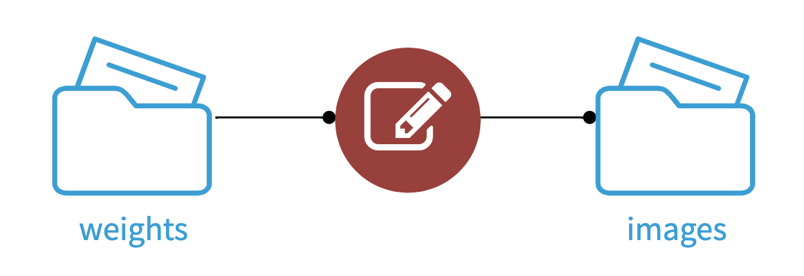

AI Art
%%%%%%

This plugin allows you to generate images from text using
`Stable Diffusion <stable-diffusion-wiki_>`_

.. figure:: _static/pirate-ship.png
   :alt: A pirate ship sailing in outer space

   An image generated by AI Art using the prompt "A pirate ship sailing in outer
   space"

How to set up
=============

CUDA
----
A CUDA-capable GPU with at least 6 GB of VRAM is recommended.
You can run the plugin without a GPU, but it will be significantly slower.

If you're using a CUDA GPU, your GPU must support CUDA 11.6, and the NVIDIA
drivers must be installed on the server. For installation instructions, see
`NVIDIA Driver Installation Quickstart Guide <nvidia-install-guide_>`_.

Download weights
----------------
Before you can use the plugin, you need pre-trained weights. You can download
weights from Hugging Face by following the steps below.

.. warning::
   The weights available on Hugging Face are licensed under the CreativeML
   OpenRAIL++-M license, which restricts usage. You can view the license
   `here <stabilityai-license_>`_.

   If you don't agree with the license, you can alternatively use your own
   weights and skip this section

#.  Install `Git LFS <git-lfs_>`_ on the DSS server:

    * Install on Cloud Stacks:

      When using Dataiku Cloud Stacks, you can install Git LFS by adding a setup
      action to your instance template that installs the *git-lfs* system
      package.

      If you're running DSS 11.2, 11.3, or 11.4, you also need to add a setup
      action that runs the following Ansible tasks:

      .. code-block:: yaml

         - name: Check if rh-git227 config dir exists
           register: rh_gitdir
           ansible.builtin.stat:
             path: /etc/opt/rh/rh-git227
             get_attributes: false
             get_checksum: false
             get_mime: false

         - name: Enable Git LFS for rh-git227
           become: true
           when: rh_gitdir.stat.exists
           ansible.builtin.blockinfile:
             path: /etc/opt/rh/rh-git227/gitconfig
             create: true
             marker: '# {mark} ANSIBLE MANAGED LFS CONFIG'
             block: |
               [filter "lfs"]
                 clean = git-lfs clean -- %f
                 smudge = git-lfs smudge -- %f
                 process = git-lfs filter-process
                 required = true

      .. image:: _static/git-lfs-setup-actions.png
         :alt: Screenshot showing the setup actions needed for Cloud Stacks

      Don't forget to replay the setup actions for your instance after modifying
      the instance template.

      Refer to `Instance templates and setup actions <instance-templates_>`_ for
      more information about setup actions in Cloud Stacks.

    * Install on RHEL-based distros (not Cloud Stacks):

      .. code-block:: bash

         yum install git-lfs
         git lfs install --system

    * Install on Debian-based distros:

      .. code-block:: bash

         apt install git-lfs
         git lfs install --system

    * Install on macOS (using `Homebrew <homebrew_>`_):

      .. code-block:: bash

         brew install git-lfs
         git lfs install

#.  Create a managed folder in DSS, and download the model to it using the
    *Download Stable Diffusion weights* macro.

    .. warning::
       Using a folder that's stored on the local filesystem is recommended. If
       the folder is stored on a remote connection (Amazon S3, Google Cloud
       Storage, etc), the weights will be downloaded to a temporary directory
       every time the recipe is run.

    .. image:: _static/instructions-macro-1.png
       :alt: Screenshot showing where to access the macro in the Flow

How to use
==========
AI Art contains two methods for generating images: Text-to-Image Generation, and
Text-Guided Image-to-Image Generation

Text-to-Image Generation
------------------------
Text-to-Image Generation is used to generate images from a text prompt.

.. image:: _static/text-to-image.png
   :alt: Diagram showing how Text-to-Image Generation works

#.  Create a *Text-to-Image Generation* recipe with your weights folder as the
    input.

#.  Enter a text prompt in the *Prompt* field.

#.  If you're using the *fp16* revision of the weights, be sure to check the
    *Half precision* field.

Text-Guided Image-to-Image Generation
-------------------------------------
Text-Guided Image-to-Image Generation is used to modify an existing reference
image based on a text prompt.

.. image:: _static/instructions-text-guided-image-to-image-1.png
   :alt: Screenshot showing what the Flow looks like when using the recipe

#.  Obtain a reference image that you want to use as a base, and upload it to a
    managed folder.

#.  Create a *Text-Guided Image-to-Image Generation* recipe with your weights
    folder and your base-image folder as the inputs.

#.  Enter a text prompt in the *Prompt* field.

#.  Enter the path to your base image in the *Base image* field.

#.  If you're using the *fp16* revision of the weights, be sure to check the
    *Half precision* field.

.. image:: _static/instructions-text-guided-image-to-image-2.png
   :alt: Screenshot of the recipe settings

.. _stabilityai-license: https://huggingface.co/stabilityai/stable-diffusion-2/raw/main/LICENSE-MODEL
.. _git-lfs: https://git-lfs.github.com/
.. _stable-diffusion-wiki: https://en.wikipedia.org/wiki/Stable_Diffusion
.. _homebrew: https://brew.sh/
.. _nvidia-install-guide: https://docs.nvidia.com/datacenter/tesla/tesla-installation-notes/index.html
.. _instance-templates: https://doc.dataiku.com/dss/latest/installation/cloudstacks-aws/templates-actions.html
